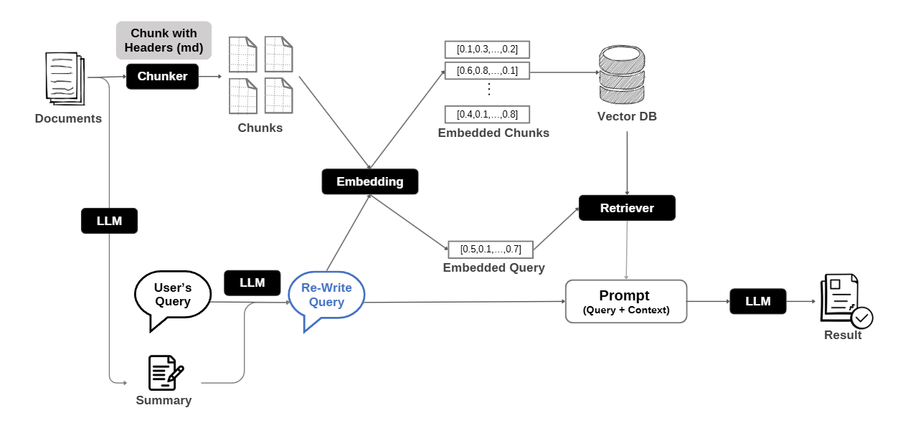
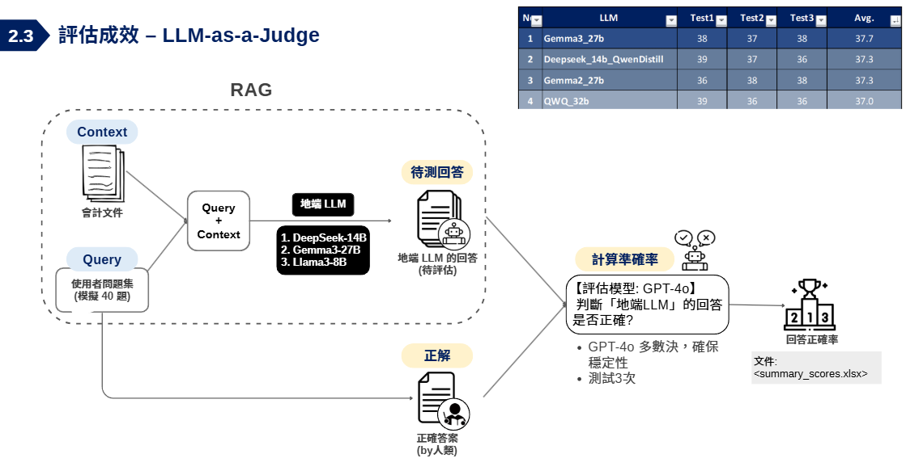

# 📚 文件検索聊天機器人（RAG 知識庫整合）

## 🌟 專案目標
本專案是一個 Retrieval-Augmented Generation (RAG) 文件検索聊天機器人，能根據使用者上傳的資料 (KEYPO 功能手冊文件) 進行検索並提供正確回覆。
- 當知識庫中找不到答案時，會明確回覆「不知道」，避免產生幻覺回覆
- 影片連結：[Demo Video](RAG_DocChatbot_20250324.gif)

---

## ⚙️ 執行步驟

### 1⃣ 安裝相關依賴
```bash
pip install -r requirements.txt
```

### 2⃣ 啟動本地 LLM (Ollama 必須已啟動)
- 請建立 `.env` 檔案（請參考 `.env` 格式，含 Azure OpenAI API 設定或本地 LLM 設定）

### 3⃣ 啟動 Streamlit 應用
```bash
streamlit run rag_app.py
```

### ⚠️ 注意事項
- 支援內部 LLM (Ollama API) 與外部 Azure OpenAI 模型
- 當無法検索到有效答案時，會回覆「不知道」

---

## ✅ 主要功能

### 1⃣ 文件上傳與處理
支援 PDF / Markdown 文件上傳，自動解析、摘要並將內容嵌入向量資料庫

### 2⃣ 文件検索聊天回覆 (RAG 流程)
根據使用者問題，検索相關文件內容，並搭配 LLM 給予回應

### 3⃣ 雙模式聊天支援
可切換「個人 KM (RAG 模式)」或「一般 LLM 模式 (直接回覆)」

### 4⃣ 聊天與文件歷史記錄
自動儲存聊天紀錄與文件摘要，可下次設備時輕鬆調用

### 5⃣ 安全機制
如知識庫中無相關內容，會回覆「不知道」以避免幻覺答案

### 6⃣ 模型回答準確率評估模組 (evaluation/)
自動執行 QA 測試，產生問題，呼叫多個 LLM 回答，並以評定模型量化回答準確度
- 評估項目：回答一致性、正確率、相似度 (LLM 判分)
- 支援地線與雲端模型混合評估
- 輸出 CSV 結果，便於視覺化、報表生成、模型選型
- 詳細請觀 [evaluation 說明文件](evaluation/README_evaluation.md)

---

## 🛠️ 技術架構
| 元件              | 技術                                                                 |
|-------------------|----------------------------------------------------------------------|
| 前端介面          | Streamlit                                                           |
| 檔案處理          | langchain + PyPDFLoader + TextLoader                                |
| 文件分段與嵌入向量 | langchain text splitter + ChromaDB                                   |
| 語言模型 (LLM)    | Azure OpenAI API 與本地 Ollama API (支援 Llama3、Gemma2、Taide)     |
| RAG 流程實作      | LangChain Retriever + Stuff Documents Chain                          |
| 本地向量資料庫    | ChromaDB                                                            |
| 後端儲存          | SQLite (使用者、開發記錄)                                      |
| 模型評估與測試    | Evaluation 模組 (自動 QA 產生，多模型回答與準確率評估)      |

---
## 📈 系統流程圖

### 🔄 RAG 問答流程
透過 RAG（Retrieval-Augmented Generation）流程，使用者問題將結合知識庫內容與語言模型進行回答。
  
🔗 [查看高解析圖片](https://www.canva.com/design/DAGip48-pIo/bx9DFPr341IQno54AC2TyQ/view?utm_content=DAGip48-pIo&utm_campaign=designshare&utm_medium=link2&utm_source=uniquelinks&utlId=hb127ce56f4)

### 🧪 模型評估流程（Evaluation Module）
模組將自動化產生問題、呼叫多個模型回答，並以 LLM 執行多次評估量化準確率。


---

## 📂 專案結構
```
RAG_DocChatbot/
├─ 📦 rag_app.py          # 📌 主程式入口（Streamlit 啟動點）
├─ 📁 views               # 前端元件（Streamlit 畫面）
│   ├─ main_page_content.py
│   └─ main_page_sidebar.py
├─ 📁 controllers         # 控制層（初始化與 UI 控制）
│   ├─ initialize.py
│   └─ ui_controller.py
├─ 📁 services            # 服務層（文件處理、LLM 呼叫）
│   ├─ document_services.py
│   └─ llm_services.py
├─ 📁 models              # 資料模型、RAG 流程與資料庫互動
│   ├─ database_base.py
│   ├─ database_devOps.py
│   ├─ database_userRecords.py
│   ├─ document_model.py
│   ├─ llm_model.py
│   └─ llm_rag.py
├─ 📁 apis                # API 模組 (嵌入服務、LLM 服務、檔案路徑)
│   ├─ embedding_api.py
│   ├─ file_paths.py
│   └─ llm_api.py
├─ 📁 evaluation/         # 📊 模型評估模組：自動產生 QA 並量化模型準確率
│   ├─ 📦run_llm_evaluation.py
│   ├─ export_data.py
│   ├─ gen_qa.py
│   └─ eval_answer.py
├─ 📁 data/               # 動態產生的用戶資料與結果
│   ├─ 📁 developer/
│   └─ 📁 user/
└─  .env                  # 環境變數設定檔
```

---

## 📞 聯絡方式
若有問題或需要協助，請提出 Issue 或直接聯絡專案責任人。  
**valerie7331@gmail.com**

